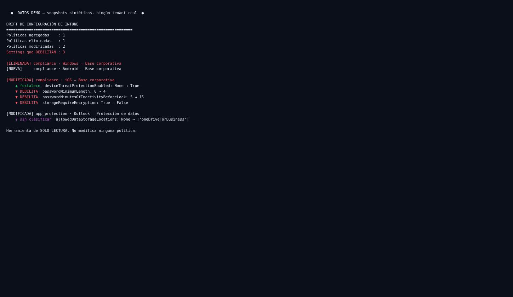

# intune-drift

> **Snapshot, not maintained.** This tool works and its tests pass, but it is not under
> active development: I am not adding features and I do not review pull requests on a
> schedule. Issues are welcome and I do read them — a reply may take a while. Last
> substantive change: September 2026.
>
> Maintained instead: [revtriage](https://github.com/earbona23/revtriage),
> [entra-tripwire](https://github.com/earbona23/entra-tripwire),
> [entraform](https://github.com/earbona23/entraform) and
> [vantage](https://github.com/earbona23/vantage).

Snapshots your Microsoft Intune configuration and diffs two snapshots with a security
lens — it doesn't just show what changed, it flags the changes that **weaken** your
posture. Read-only, and a test enforces that.

## The problem

Intune configuration drifts. Compliance policies, device configuration profiles, and app
protection policies get edited over weeks by different admins, and nobody has a clear
answer to "what changed since last month, and did any of it make us less secure?" A
setting flipped from *disk encryption required* to *not required*, a minimum PIN length
dropped from six to four, an inactivity lock stretched from five minutes to fifteen — each
is one click in the portal and invisible afterward. The portal shows you the current
state; it doesn't show you the delta, and it certainly doesn't tell you which deltas
matter.

## See it in 10 seconds — no tenant required

```bash
git clone https://github.com/earbona23/intune-drift
cd intune-drift
python -m drift.cli --demo        # diffs two synthetic snapshots
```

Everything is labelled `DEMO DATA`. The output separates what weakens the posture from
what strengthens it:

```
Settings que DEBILITAN : 3

[MODIFICADA] compliance · iOS — Base corporativa
    ▲ fortalece  deviceThreatProtectionEnabled: None → True
    ▼ DEBILITA  passwordMinimumLength: 6 → 4
    ▼ DEBILITA  passwordMinutesOfInactivityBeforeLock: 5 → 15
    ▼ DEBILITA  storageRequireEncryption: True → False
```



## Use it on a real tenant

```bash
pip install -r requirements.txt
cp config.example.yaml config.yaml     # tenant/client id; secret via env var
export IDRIFT_CLIENT_SECRET=...

python -m drift.cli snapshot --live --salida 2026-08.json    # capture, e.g. monthly
python -m drift.cli diff 2026-07.json 2026-08.json           # what changed, security-first
```

Snapshots are plain JSON — commit them to a repo and you get a full history of your Intune
posture for free, with `git log` as the audit trail. The `diff` command exits with code
`2` when any change weakens the posture, so it works as a CI step that alerts on a
regression:

```yaml
- run: python -m drift.cli diff baseline.json current.json
```

## What makes the diff a *security* diff

A generic diff tells you a value changed. What matters is the **direction**: is *disk
encryption required → not required* a weakening or a hardening? That knowledge —the secure
direction for each setting— lives in [`rules/weakening.yaml`](rules/weakening.yaml), an
editable catalog, not buried in code. Each rule says whether a setting is a boolean that
should hold a secure value, a number that's safer higher (minimum PIN length), or one
that's safer lower (minutes before lock). Change a setting the catalog doesn't know about
and it's reported as **`no_clasificado`** — surfaced for review, never assumed harmless.

### Permissions — read-only

`DeviceManagementConfiguration.Read.All` and `DeviceManagementApps.Read.All`. The Graph
client exposes only `get()`/`get_all()`; `tests/test_readonly_guarantee.py` fails if a
write verb appears anywhere in the module. It reads your Intune config; it never touches
it.

## Limitations

- **Coverage is three policy families** — device compliance, device configuration, and app
  protection. The settings-catalog and endpoint-security surfaces are larger and messier;
  they're a natural next step, not in scope today, and the README says so rather than
  implying full coverage.
- **The weakening catalog is a starting point.** It encodes common settings and their
  secure direction; extend it for your environment. An unlisted setting is flagged for
  review, not silently judged.
- **This detects drift, it doesn't assess a baseline.** For "does this tenant meet a
  published security baseline," tools like CISA's ScubaGear are the right fit; intune-drift
  answers the narrower, unserved question of *what moved and did it get worse*.
- **`--live` is unit-tested with mocked Graph responses.** Validate against your tenant
  before relying on it.

## Contributing

New entries in the weakening catalog are welcome — add the setting and its secure
direction, and the tests will cover it. Keep collectors read-only. Run `pytest -q` and
`ruff check .`.

## License

MIT — see [LICENSE](LICENSE).
